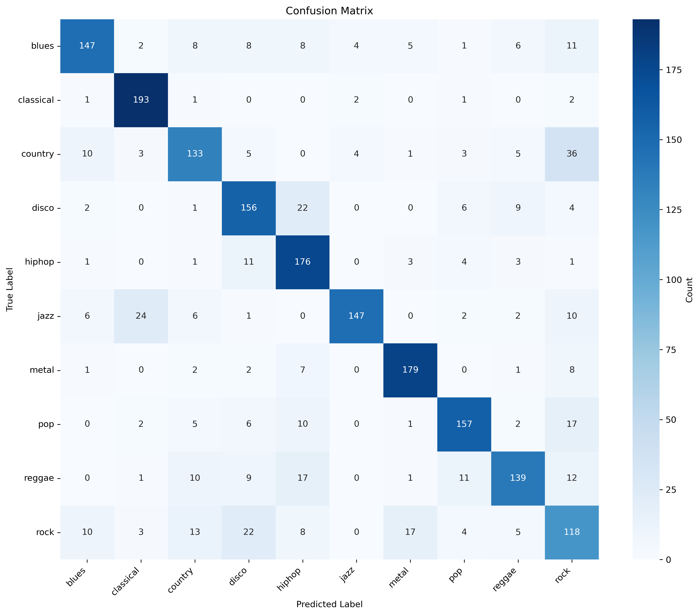
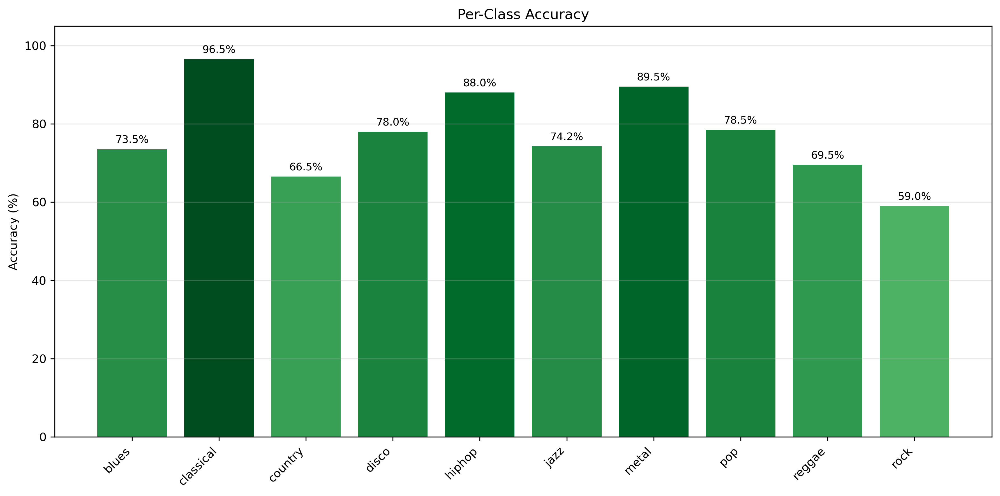
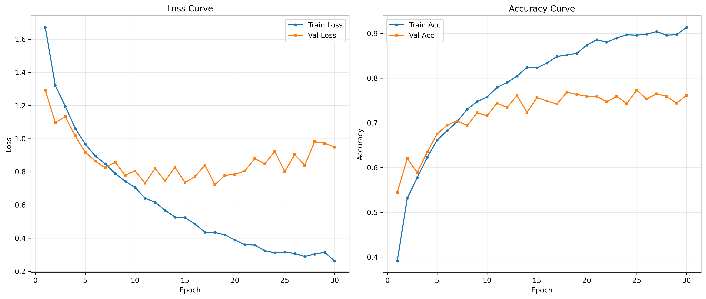
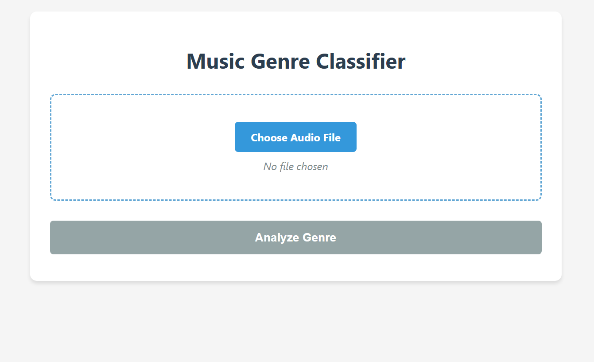

# Music Genre Classifier


A Convolutional Neural Network (CNN) for music genre classification, utilizing MFCC features extracted from the GTZAN dataset.

## Introduction

The CNN model was trained on the GTZAN dataset, a legacy collection comprising 1,000 audio tracks sampled at 22,050 Hz. The data is organized into 10 balanced classes of 100 tracks each.

GTZAN is not a gold-standard benchmark, but it is an accessible training resource for the classifier. It is important to note that the dataset has inherent limitations like low fidelity, potential artist repetition, and noise, which constrains the model's ability to generalize to real-world audio. However, it remains highly effective for demonstrating the CNN's ability to extract hierarchical features and distinguish timbral textures within a specific distribution.

### Dataset Overview

The dataset consists of 10 genres:
- Blues
- Classical
- Country
- Disco
- HipHop
- Jazz
- Metal
- Pop
- Reggae
- Rock
  
All audio files are 30-second WAV files sampled at 22,050 Hz.

### Data Augmentation via Segmentation
To increase the amount of training samples and improve model generalization, each 30-second track is split into 10 equal segments of 3 seconds. This produces:

- **1 original track → 10 training samples**
- **1,000 tracks → 10,000 MFCC samples (before splitting into train/val/test)**

Each 3-second segment is converted into Mel-Frequency Cepstral Coefficients (MFCCs) with a shape of **(T, 13)**, where *T* is the number of time frames for that 3s window and `13` is the number of MFCC coefficients.

After segmentation, the dataset is split approximately **60/20/20** into:
- **Train:** 5,991 samples  
- **Validation:** 1,997 samples  
- **Test:** 1,998 samples  

This approach exposes the model to multiple localized snapshots of each track, facilitating the learning of robust patterns in rhythm and timbre.

## Table of Contents
- [How It Works](#how-it-works)
- [Results](#results)
- [Setup](#setup)
- [Dataset Download](#dataset-download)
- [Feature Extraction](#feature-extraction)
- [Training](#training)
- [Inference](#inference)
- [Web Application](#web-application)
- [Future Improvements](#future-improvements)

---

## How It Works
### 1. **Feature Extraction (MFCC)**

MFCC (Mel-Frequency Cepstral Coefficients) captures the timbral characteristics of audio.
- Input: 30-second audio clip
- Process: Split into 10 segments (3s each) -> Extract 13 MFCCs
- Output: (10, 130, 13) matrix 

### 2. **Model Architecture (CNN)**

A Convolutional Neural Network processes the MFCC image-like data:

- **Convolutional Layers (x3):** Extract spatial features from the MFCC spectrogram.
- **Flatten Layer**: Converts 2D feature maps to 1D vectors.
- **Fully Connected Layers (x2)**: Dense layers for classification logic.
- **Softmax Output**: Returns a probability distribution across the 10 genres.

### 3. **Inference Logic**

The model expects 30-second inputs to match its training distribution. When a user uploads a file, the system applies the following logic:

- **For Short Audio (< 30 seconds):** Padded with silence to reach 30 seconds.

- **For Long Audio (> 30 seconds):** Truncated to the first 30 seconds.

- **Processing**: The resulting 30s clip is split into segments, and predictions are averaged across segments to determine the final genre.

**Note:** Most tracks establish their genre characteristics (instrumentation, tempo, rhythm) in the intro.

---
## Results 

- **Test Accuracy:** 77.33%
- **Confusion Matrix:**

<p align="center">
  
</p>

- **Per Class Accuracy:**

<p align="center">
  
</p>

- **Training curves:** 
  
<p align="center">
  
</p>

---

## Setup

### 1. Clone Repository
```bash
git clone https://github.com/davitz1/gtzan-classifier.git
cd gtzan-classifier
```
### 2. Create Virtual Environment (Recommended)
```python
# Using conda
conda create -n gtzan python=3.10
conda activate gtzan

# Or using venv
python -m venv venv
source venv/bin/activate  # On Windows: venv\Scripts\activate
```
### 3. Install dependencies
```python
pip install -r requirements.txt
```
---
## Dataset Download
GTZAN can be downloaded through Kaggle API or manually.

### Manual Download
1. Visit https://www.kaggle.com/datasets/andradaolteanu/gtzan-dataset-music-genre-classification
2. Download and extract the zip file
3. Move the `genres_original` folder to: `gtzan-classifier/data/gtzan/genres_original/`

### API Download
**API Option Requirements:** Kaggle account and API credentials.

**Configure Kaggle API:**
1. Go to https://www.kaggle.com/settings/account  → Account → 'Create New API Token'.
2. Create a `kaggle.json` in: 
**Windows**:`%USERPROFILE%\.kaggle\kaggle.json`
**Linux/Mac**: `~/.kaggle/kaggle.json` (Run `chmod 600 ~/.kaggle/kaggle.json`)
3. Paste this content (replace with your credentials):
```json
{ 
 "username": "your_kaggle_username",
    "key": "your_api_key_here"
}
```

**Download the dataset:**
```bash
#INSTALL KAGGLE API
pip install kaggle

#RUN THE DOWNLOAD SCRIPT 
python download_dataset.py
```
- This script downloads the 1.2 GB dataset, extracts it, and verifies the directory structure.
---
## Feature Extraction
Extract MFCC features from the audio files:
```bash
python src/data_processing/feature_extractor.py
```
This will:
- Load each 30-second audio file
- Split into 10 segments of 3 seconds each
- Extract 13 MFCC coefficients per segment
- Saves to `mfcc_data.npz`
---
## Training
Train the CNN model:
```bash
python src/training/train_mfcc.py
```
Training configuration:
- Batch size: 32
- Epochs: 30
- Learning rate: 0.001
- Train/Val/Test split: 60%/20%/20%
- Device: CUDA if available, else CPU

Output:
- Saved model: `mfcc_cnn_trained.pth`
- Plots: `plots/`

**Expected accuracy:** ~77% on test set

---
## Inference
Classify a single audio file:
```bash
python src/inference/infer_mfcc.py path/to/your/song.wav
```
Python Script
```python
from src.inference.infer_mfcc import GenreClassifier

# Load model
classifier = GenreClassifier("outputs/mfcc_cnn/mfcc_cnn_trained.pth")

# Classify a song
result = classifier.predict("song.wav", return_probabilities=True)

print(f"Genre: {result['genre']}")
print(f"Confidence: {result['confidence']*100:.2f}%")
```
---
## Web Application
**Interface Preview**
<p align="center">
  
</p>
Start the Server

```bash
python src/app/main.py
```
Access: Open http://localhost:8000 in your browser

Features:
- Drag & drop or click to select an audio file
- Supported formats: .wav (recommended), .mp3, .flac, .ogg, .m4a
- Real-time prediction
---

## Future Improvements
To move beyond the limitations of the GTZAN dataset and simple CNN architecture, future work could include:

- **Dataset Scaling:** Training on the **FMA (Free Music Archive)** dataset to improve generalization to real-world audio.
- **Architecture:** Implementing **CRNNs (Convolutional Recurrent Neural Networks)** to better capture temporal dependencies in longer audio sequences.
- **Data Augmentation:** Adding noise injection, pitch shifting, and time stretching to make the model robust against low-quality inputs.
- **Transfer Learning:** Fine-tuning pre-trained audio models (like VGGish or OpenL3) instead of training from scratch.

## Citation


Tzanetakis, G., & Cook, P. (2002). **Musical genre classification of audio signals**. *IEEE Transactions on Speech and Audio Processing*, *10*(5), 293-302.

--- 
## License

This project is for educational purposes. 

**Dataset:** GTZAN has its own terms of use for research purposes.

**Code:** MIT License
